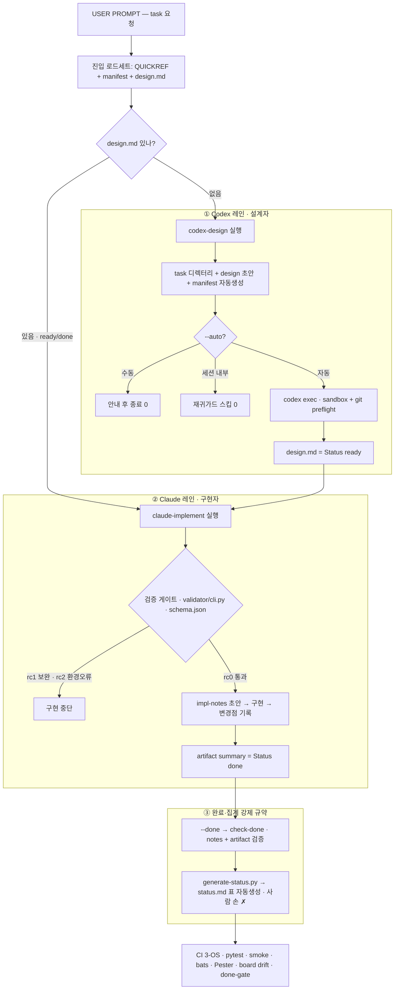

# Codex-With-Claude

> **[English](./README.en.md)** | 한국어

Codex가 설계하고, Claude가 구현하는 협업 워크스페이스.

## 개요

이 저장소는 **Codex(설계자) → Claude(구현자)** 루프를 반복 가능한 작업 환경으로 만든 것입니다.

- Codex가 `design.md`에 설계를 작성하면
- Claude가 그 문서를 읽고 구현을 진행합니다
- 설계 문서가 불완전하면 구현이 자동으로 차단됩니다

## 게임 프로젝트 오버레이 — Client is King

이 클론은 CWC 런타임 위에서 **한식당 경영 시뮬레이션 게임 `Client is King` (손님이 왕이다)** 을 개발하는 워크스페이스입니다.

- **Unity 6** (에디터 6000.3.8f1, 2D URP) 프로젝트: `game/` — task-102 에서 생성
- 컨셉·로드맵 SSOT: [kb/concepts/project-brief.md](./kb/concepts/project-brief.md) · 스코프 가드: [kb/concepts/demo-scope.md](./kb/concepts/demo-scope.md)
- 게임 task 는 `task-101`+ 로 `kb/tasks/` 에서 관리 (핵심 경로: `game/` · `kb/` · `runtime/`)

## 워크플로우

사용자 프롬프트부터 **Codex(설계자)** 와 **Claude(구현자)** 가 각각 거치는 흐름. 자세한 설명은 [kb/concepts/workflow.md](./kb/concepts/workflow.md).



곳곳의 방어선: `--auto` 실패 non-zero 전파 · 재귀가드(`CLAUDECODE`) · 컨텍스트 예산 `context-budget.py`(경고) · `design.md` 는 Codex 소유(Claude 미수정).

## 구조

```
├── QUICKREF.md                # 빠른 운영 참조 (routine 진입점)
├── AGENT.md                   # 공통 에이전트 규약 + 상태 전이 정의 (정본)
├── CLAUDE.md                  # Claude 운영 규약
├── collab.md                  # 리뷰 루프 인터페이스/enum/게이트 정본 (v2 active)
├── UPDATING.md                # 기존 클론에 최신 CWC 반영하는 절차
├── kb/                        # 지식 저장소 (로컬 마크다운 vault)
│   ├── index/                 # status.md(생성형 보드), 목차
│   ├── concepts/              # 아키텍처, 워크플로우
│   ├── tasks/<task-id>/       # design.md · implementation-notes.md · manifest.md
│   └── artifacts/             # 산출물 요약
├── runtime/                   # 실행 스크립트 + 검증/도구 (Bash · PowerShell · Python)
│   ├── codex-design.{sh,ps1}      # Codex 설계 요청 + manifest 자동생성 + 후검증
│   ├── claude-implement.{sh,ps1}  # 설계 검증 + 구현 안내 + --done 완료검증
│   ├── validator/                 # design.md 검증 단일원천 (schema.json + Python)
│   ├── lib/                       # python probe · 세션감지 · invoke-codex/claude
│   ├── context-budget.py          # 컨텍스트 예산 경고 (warning-only)
│   ├── generate-status.py         # status.md 보드 자동생성 + --check drift
│   └── README.md                  # 외부 CLI 계약 + 종료코드 규약
├── templates/                 # design · implementation-notes · artifact · manifest 템플릿
└── tests/                     # pytest(validator·context_budget·status_board) + bats + pester + smoke
```

## 사용법

### 1단계: Codex에게 설계 요청

```powershell
# PowerShell
./runtime/codex-design.ps1 task-004 "사용자 인증 모듈 설계"

# Bash
./runtime/codex-design.sh task-004 "사용자 인증 모듈 설계"
```

> 새 task 생성 시 `manifest.md` 가 자동 생성된다. `--auto` 를 주면 Codex 가 자동 호출된다.

### 2단계: Claude에게 구현 요청

```powershell
# PowerShell
./runtime/claude-implement.ps1 task-004

# Bash
./runtime/claude-implement.sh task-004
```

### 3단계: 완료 검증 (구현 후, 선택)

```powershell
# PowerShell
./runtime/claude-implement.ps1 task-004 -Done

# Bash
./runtime/claude-implement.sh --done task-004
```

> done-gate: `implementation-notes.md` 와 `kb/artifacts/<id>-summary.md` 가 채워졌는지 검사한다.
> 완료 task 가 생기면 `python3 runtime/generate-status.py` 로 `kb/index/status.md` 보드가 자동 갱신된다(CI 가 drift 를 검사).

## 설계 문서 검증

`claude-implement`와 `codex-design` 모두 동일한 검증을 수행합니다. 검증 항목·차단 조건의 단일 진실 원천은 [`runtime/validator/schema.json`](./runtime/validator/schema.json) 이며, 사람이 읽는 요약은 [QUICKREF.md](./QUICKREF.md) "검증 게이트" 절에 있습니다.

## 문서 상태 전이

설계 준비도(design.md)와 구현 진행도(implementation-notes.md)를 **두 층으로 분리**합니다. 상태 모델의 단일 진실 원천은 [AGENT.md](./AGENT.md) "문서 상태 전이" 절입니다.

## 환경

- **Windows**: PowerShell `.ps1` 스크립트 (UTF-8 BOM, `codex.cmd` 호출)
- **macOS/Linux**: Bash `.sh` 스크립트
- **지식 저장소**: 로컬 마크다운 파일 (Obsidian 등으로 열람 가능)

## 로드맵

- **v1**: Codex 설계 → Claude 구현 루프 + 검증 게이트 · 컨텍스트 예산 · 생성형 status board · done-gate.
- **v2 (현재)**: 모델/effort 강제 + 프롬프트 SSOT, (선택) 설계 교차검토(`review-design`),
  `collab.md` 기반 Codex 구현 리뷰 루프(`codex-review`) + approved-done 게이트.
- **v2+ (보류)**: Notion 등 외부 백엔드 어댑터 — 두 번째 backend 요구가 실제로 생길 때 도입.

## 업데이트

이미 CWC 를 클론해서 작업 중인 디렉터리에 최신 프레임워크를 **작업 손실 없이** 반영하는 절차는
[UPDATING.md](./UPDATING.md) 에 있다. 그 디렉터리의 AI 에이전트에게 "UPDATING.md 를 읽고 업데이트를
진행하라" 고 시켜도 된다 (문서 하단에 에이전트용 순서가 있다).

## License

이 저장소는 **코드**와 **프로젝트 고유 아트**에 서로 다른 조건이 적용됩니다.

- **코드**: [MIT License](./LICENSE) (© 2026 P0t4t0).
- **프로젝트 고유 아트** (AI 보조 콘셉트 원본 `kb/concepts/art-originals/**`; NYC 런타임 아트 `game/Assets/Art/NYC/**`는 아직 미포함 — 향후 task-116에서 추가 예정): **MIT 적용 제외.** 프로젝트 오너는 별도의 재사용·재배포·2차 저작물 작성 허가를 부여하지 않습니다. AI 요소의 저작권 성립과 보호 범위는 관할권에 따라 달라질 수 있으며, 독점성·고유성·비침해성은 보증하지 않습니다. **CC0 아님.**
- **플레이스홀더 아트**: 각 원본 팩의 **CC0 1.0** — 출처는 [PLACEHOLDER-PROVENANCE](game/Assets/Art/Placeholders/PLACEHOLDER-PROVENANCE.md)에 명시(CC0는 표기 의무가 없어 전문은 번들하지 않음).
- **폰트**: Galmuri11 — **SIL Open Font License 1.1**.
- **서드파티 고지**: [THIRD-PARTY-NOTICES.md](./THIRD-PARTY-NOTICES.md). 코드 MIT·폰트 OFL 전문과 서드파티 고지는 게임 빌드의 `StreamingAssets/Licenses/`에 동봉됩니다.

### AI 보조 아트 고지

Client is King의 NYC 코리아타운 배경, 캐릭터, 음식 및 UI 아이콘 일부는 프로젝트 오너가 승인한 비주얼 콘셉트를 바탕으로 OpenAI의 Codex 내 이미지 생성 도구를 사용해 사전 생성하고, 프로젝트 팀이 방향을 정하고 선택·검수·통합한 AI 보조 아트입니다. 정확한 백엔드 모델 식별자는 도구에서 노출되지 않아 추정하여 표기하지 않습니다. 게임 실행 중에는 생성형 AI 또는 외부 AI 서비스를 사용하지 않습니다.

(English: see [README.en.md](./README.en.md#license).)
